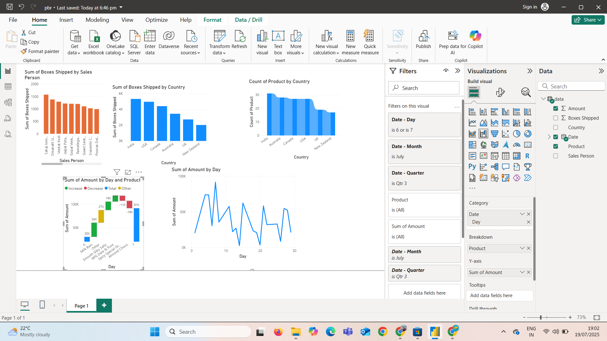

# 🍫 Chocolate Sales Report – Power BI Dashboard

##  Overview
This project contains a Power BI report analyzing chocolate sales using time-series data collected at 10-minute intervals. The dashboard provides key insights into sales performance, trends, and product-level analysis.

##  Files Included
- `pbr.pbix` – Power BI report
- `sample-data-10mins.xlsx` – Excel dataset used as the data source

##  How to Use
1. Download both `pbr.pbix` and `sample-data-10mins.xlsx`.
2. Open the `.pbix` file in **Power BI Desktop**.
3. If needed, update the data source path by going to:
   - **Transfer Data** → **Data Source Settings**
   - Point to the downloaded Excel file

##  Key Insights
- Time-based sales trends (10-minute intervals)
- Product-level sales analysis
- Interactive filtering for deep dive

##  Author
Pushpaa86  
https://www.linkedin.com/in/pushpanjali-mamidakula-160083220/

##  Tools Used
- Power BI Desktop
- Microsoft Excel

- 

